# Helio: Real-Time Collaborative Development Platform


> **"Code Together, Build Faster."**
>
> Helio is a robust, distributed collaborative code editor designed for real-time engineering teams. It allows developers from across the globe to write, debug, and execute code in a shared environment with **zero latency** and **mathematically proven data consistency**.

---

## 💎 Core Features

### 1. 🚀 Real-Time Collaboration (CRDTs)
*   **Conflict-Free Editing**: Powered by **Yjs** and **CRDTs (Conflict-Free Replicated Data Types)**, ensuring that multiple users can type simultaneously without ever overwriting each other's work.
*   **Live Presence**: See exactly where your team members are working with color-coded remote cursors and selection highlights.

### 2. 🔐 Enterprise-Grade Authentication
*   **Dual-Login System**: Sign in using either your **Email** or a custom **Username**.
*   **Secure Registration**: Multi-step flow with **Email Verification (OTP)** via Brevo.
*   **Session Management**: Stateless authentication using **JWT (JSON Web Tokens)** with secure HTTP headers.
*   **Password Security**: Industry-standard **Bcrypt** hashing strategies.

### 3. ⚡ Code Execution Engine
*   **Multi-Language Support**: Run C++, Python, Java, JavaScript, and more directly in the browser.
*   **Sandboxed Environment**: Powered by the **Piston API** for secure, isolated code execution.
*   **Unlimited Scale**: No rate limits or local binaries required on the host server.

### 4. 🎨 Smart UI & Whiteboard
*   **Integrated Whiteboard**: A shared infinite canvas for system design diagrams (Architecture, Flowcharts).
*   **Atomic Design System**: A custom-built UI library using glassmorphism and semantic CSS variables.

---

## 🏗 System Architecture (Detailed)

This diagram represents the complete data flow of the Helio platform, including Authentication, Real-time Sync, and External Service Integrations.

```mermaid
graph TD
    %% Subgraph Styling
    classDef client fill:#e1f5fe,stroke:#01579b,stroke-width:2px;
    classDef server fill:#f3e5f5,stroke:#4a148c,stroke-width:2px;
    classDef db fill:#e8f5e9,stroke:#1b5e20,stroke-width:2px;
    classDef external fill:#fff3e0,stroke:#e65100,stroke-width:2px;

    subgraph Client ["🖥️ Client Application (React 18)"]
        direction TB
        UI[Atomic UI Components]
        AuthUI[Login/Register Forms]
        
        subgraph EditorEngine [Code Editor]
            CM[CodeMirror 5 Instance]
            YjsClient[Yjs CRDT Provider]
            SocketClient[Socket.io Client]
        end
    end

    subgraph LB ["☁️ Load Balancer / CDN"]
        RenderLB[Render/Vercel Edge Network]
    end

    subgraph Server ["⚙️ Backend Server (Node.js + Express)"]
        direction TB
        
        API[REST API Router]
        SocketSrv[Socket.io Service]
        
        subgraph AuthLayer [Security Layer]
            AuthCtrl[Auth Controller]
            JWT[JWT Middleware]
            Bcrypt[Bcrypt Hashing]
            Rate[Rate Limiter]
        end

        subgraph Services [Business Logic]
            RoomSrv[Room Service]
            ExecSrv["Run Controller (Axios)"]
        end
    end

    subgraph Database ["💾 Persistence Layer"]
        Mongo[("MongoDB Atlas")]
    end

    subgraph External ["🌍 External APIs"]
        Brevo[("📧 Brevo (Email/OTP)")]
        Piston[("⚡ Piston (Code Runner)")]
    end

    %% Connections
    UI --> AuthUI
    UI --> EditorEngine

    %% Network Flow
    AuthUI --HTTPS--> RenderLB
    SocketClient --WSS (WebSockets)--> RenderLB
    RenderLB --> API
    RenderLB --> SocketSrv

    %% Backend Flow
    API --> AuthLayer
    AuthLayer --> AuthCtrl
    AuthCtrl --> Bcrypt
    AuthCtrl --> JWT
    AuthCtrl --Send OTP--> Brevo

    %% Collaboration Flow
    SocketSrv --Sync Updates--> RoomSrv
    SocketSrv --Broadcast--> SocketClient
    RoomSrv --Persist State--> Mongo
    
    %% Auth Persistence
    AuthCtrl --Store User--> Mongo

    %% Execution Flow
    EditorEngine --Run Code--> API
    API --> ExecSrv
    ExecSrv --POST Source Code--> Piston
    Piston --Return Output--> ExecSrv
    ExecSrv --JSON Response--> EditorEngine

    %% Styling Application
    class UI,AuthUI,EditorEngine client;
    class API,SocketSrv,AuthLayer,Services server;
    class Mongo db;
    class Brevo,Piston external;
```



---

## 🛠 Tech Stack

| Layer | Technology | Purpose |
| :--- | :--- | :--- |
| **Frontend** | React 18 | Declarative UI Library |
| | CodeMirror 5 | Text Editor Component |
| | Socket.io-Client | Real-time WebSocket Communication |
| | Axios | HTTP Requests |
| **Backend** | Node.js & Express | Server Runtime & API Framework |
| | Socket.io | Event-based Bidirectional Communication |
| | Mongoose | MongoDB Object Modeling |
| **Security** | JSON Web Token (JWT) | Stateless Authentication |
| | Bcrypt.js | Password Hashing |
| | Helmet & Rate-Limit | API Security Hardening |
| **External** | Piston API | Remote Code Execution Sandbox |
| | Brevo (formerly Sendinblue) | Transactional Email Service (OTP) |

---

## 🧩 Key Algorithms

### 1. Conflict-Free Replicated Data Types (CRDTs)
To solve the "Split-Brain" problem in distributed systems (where two users edit the same line offline), we use Yjs.
*   **Vector Clocks**: Tracks the 'time' of edits relative to each client.
*   **Differential Synchronization**: Only sends small binary updates (deltas) over the wire, not the whole file.

### 2. Exponential Backoff (Resilience)
Custom retry logic is implemented for the Piston API calls. If the sandbox is busy, the system waits `2^n` ms before retrying, preventing server overload.

---

## 👨‍💻 Getting Started (Local Development)

1.  **Clone the Repository**
    ```bash
    git clone https://github.com/Deep99739/Helio.git
    cd Helio
    ```

2.  **Install Dependencies**
    ```bash
    # Root (Concurrent Runner)
    npm install
    
    # Client
    cd client && npm install
    
    # Server
    cd ../server && npm install
    ```

3.  **Environment Configuration**
    Create a `.env` file in `server/`:
    ```env
    PORT=5000
    MONGO_URI=your_mongodb_atlas_uri
    JWT_SECRET=your_super_secret_key
    BREVO_API_KEY=your_email_api_key
    ```
    Create a `.env` file in `client/`:
    ```env
    REACT_APP_BACKEND_URL=http://localhost:5000
    ```

4.  **Run the App**
    ```bash
    # Runs both Client and Server concurrently
    npm start
    ```

Open `http://localhost:3000` to start coding!

---

